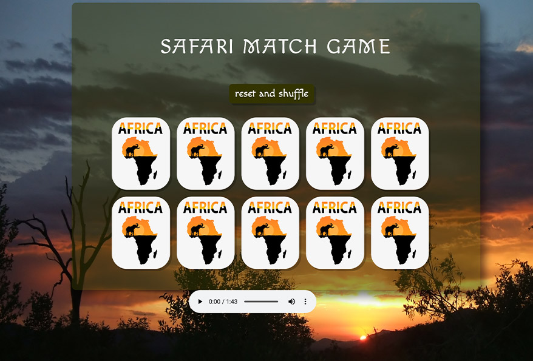

# ♠️ Matching Card Game

### Goal: Make a 10 card memory game - users must be able to select two cards and check if they are a match. If they are a match, they stay flipped. If not, they flip back over. Game is done when all cards are matched and flipped over. Example: http://www.fruit-burst.co.uk/fun-and-games/pairs-game 

**Link To Project:** https://africanmatchgame.netlify.app

### How this application was created
Javascript, Css, and Html

